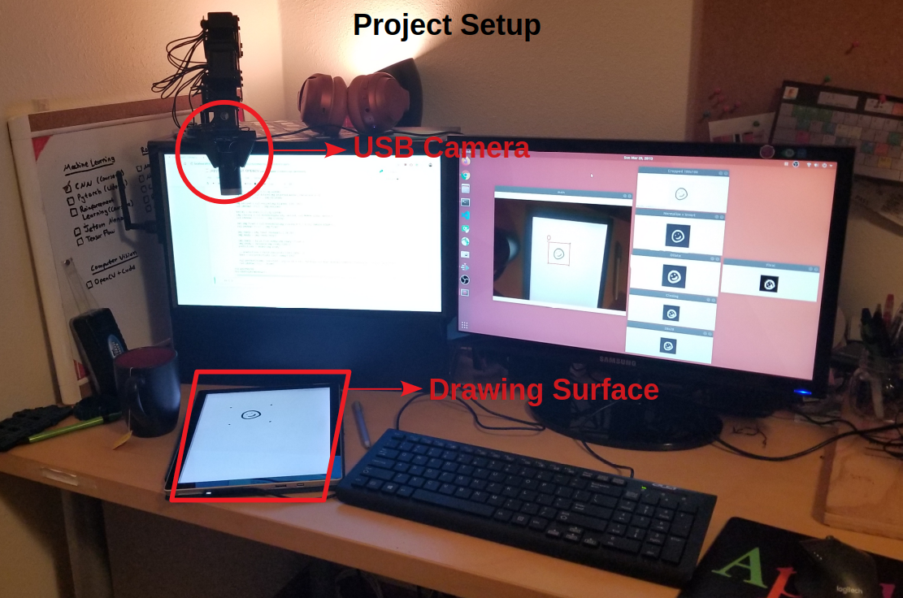

Project Video Link: https://www.linkedin.com/embed/feed/update/urn:li:ugcPost:6650842687308206080

## Project Setup



## Example


```python
# Copyright (c) 2020, Husnu Melih Erdogan
#
# Licensed under the Apache License, Version 2.0 (the "License");
# you may not use this file except in compliance with the License.
# You may obtain a copy of the License at
#
#     http://www.apache.org/licenses/LICENSE-2.0
#
# Unless required by applicable law or agreed to in writing, software
# distributed under the License is distributed on an "AS IS" BASIS,
# WITHOUT WARRANTIES OR CONDITIONS OF ANY KIND, either express or implied.
# See the License for the specific language governing permissions and
# limitations under the License.
```

# Real Time Handwritten Digit Classification


```python
# Hardware Requirements
# - USB Webcam
# - (Optional) CUDA supported graphics card
# - This program needs about 400 MB RAM to run

# Software Dependencies
# - Python 3
# - Anaconda (Optional)
# - Jupyter Notebook (Optional)
# - Pytorch
# - OpenCv 3
# - Numpy
# - Matplotlib

# Download the pre-trained model
#  - Open a new terminal and go to the project directory
#  - wget https://github.com/mlherd/Machine-Learning-Experiments/blob/master/RealTime_MNIST_CNN/cnn_model.pkl
```


```python
# Import Python Libraries

# Image Processing
import cv2

# Machine Learning
import torch
import torch.nn as nn
from torch.autograd import Variable
import torchvision.transforms as transforms
import torchvision.datasets as dsets
import collections

# Scientific Computing
import numpy as np

# Ploting
import matplotlib.pyplot as plt
```


```python
# CNN Model Class
class CNNModel(nn.Module):
    def __init__ (self):
        super(CNNModel, self).__init__()
        
        # Layer 1 
        # Convolution
        self.conv1 = nn.Conv2d(in_channels=1, out_channels=16, kernel_size=5, stride=1, padding=2)
        # Activation
        self.relu1 = nn.ReLU()
        # Pooling 
        self.maxpool1 = nn.MaxPool2d(kernel_size=2)
        
        # Layer 2
        # Convolution
        self.conv2 = nn.Conv2d(in_channels=16, out_channels=32, kernel_size=5, stride=1, padding=2)
        # Activation
        self.relu2 = nn.ReLU()
        # Pooling 
        self.maxpool2 = nn.MaxPool2d(kernel_size=2)
        
        # Fully Connected Layer
        # - 10 classes
        # - 32 * 7 * 7 = 1568
        self.fc1 = nn.Linear(32 * 7 * 7, 10)
    
    def forward(self, x):
        
        # Layer 1
        out1 = self.conv1(x)
        out1 = self.relu1(out1)
        out1 = self.maxpool1(out1)
        
        # Layer 2
        out2 = self.conv2(out1)
        out2 = self.relu2(out2)
        out2 = self.maxpool2(out2)
        
        # Flattening
        out3 = out2.view(out2.size(0), -1)
        
        # Fully Connected
        out4 = self.fc1(out3)
        
        return out4
```


```python
# Initilize the model by creating a model object using the CNNModel Class
model = CNNModel()
```


```python
# Load the pre-trained Model
model.load_state_dict(torch.load("cnn_model.pkl"))
```


    <All keys matched successfully>


```python
# Decide if we want to use CUDA
# 1 = Use CUDA, 0 = Use CPU
use_cuda = 0
```


```python
# Move the model to GPU if use_cuda = 1 and CUDA is available
if torch.cuda.is_available() and use_cuda:
    model = model.cuda()
```


```python
# Crerate a capture object using the VideoCapture constructor
# Use camera 0 (Camera id number= 0)
cap = cv2.VideoCapture(0)

while(True):
    # Capture images frame by frame
    ret, frame = cap.read()
    
    # Convert BGR image to Grayscale
    img = cv2.cvtColor(frame, cv2.COLOR_BGR2GRAY)
    
    # Size of the ROI (Region Of Interest)
    w = 100
    h = 100
    
    # Center of the captured image
    x = int(img.shape[1]/2)
    y = int(img.shape[0]/2)
    
    # Left-upper corner (a,b) and right-lower corner (c,d) pixel locations of the ROI
    a = int(x-(w/2))
    b = int(y-(h/2))
    c = int(x+w/2)
    d = int(y+h/2)
    
    # Create points the rectangle drawing
    start_point = (a, b)
    end_point = (c, d)
    
    # Draw a rectangle
    img_rect = img.copy();
    cv2.rectangle(frame, start_point, end_point, (0,0,255), thickness=2)
    
    # Crop the ROI
    img_crop = img[b:d,a:c]
    cv2.imshow('Cropped 100x100', img_crop)
    
    # Normalize the Image 255-0 -> 1-0
    # Invert the Colors 0->1 1->0
    img_normalized = img_crop/255
    img_inverted = (img_normalized-1)*-1
    cv2.imshow('Normalize + Invert', img_inverted)
    
    # Dilate the Image because pen written number is small
    kernel = np.ones((3,3),np.uint8)
    img_dilated = cv2.dilate(img_inverted,kernel,iterations = 1)
    cv2.imshow('Dilate', img_dilated)
    
    # Resize the image to the size CNN uses 28x28
    img_resized = cv2.resize(img_dilated, (28, 28))
    cv2.imshow('28x28', img_resized)
    
    # Use closing to reduce the noise and artifects after resizing
    kernel = np.ones((2,2),np.uint8)
    img_closing = cv2.morphologyEx(img_resized, cv2.MORPH_CLOSE, kernel)
    cv2.imshow('Closing', img_closing)
    
    # Conver the image to binary image. Black and white pixels only
    ret,img_final = cv2.threshold(img_closing,0.5,1.0,cv2.THRESH_BINARY)
    cv2.imshow('Final', img_final)
    
    # Reshape the image for the CNN
    img_ready = img_final.reshape(1,1,28,28)
    img_ready = img_ready.copy()
    
    # Make the image a Pytorch variable
    # Move the Variable to GPU if use_cuda = 1 and CUDA is available
    img_ready = torch.from_numpy(img_ready).float()
    if torch.cuda.is_available() and use_cuda:
        img_ready = Variable(img_ready.cuda())
    else:
        img_ready = Variable(img_ready)
    
    # Get all the predictions
    predictions = model(img_ready)
    
    # Use the largest one as the final prediction
    _, predictions = torch.max(predictions.data, 1)
    text = str(predictions.cpu().numpy()[0])
    
    # Write the predicted class in the image
    cv2.putText(frame, text=text, org=(a-10,b-10), fontFace=cv2.FONT_HERSHEY_SIMPLEX, fontScale=1, color=(0,0,255), thickness=2, lineType=cv2.LINE_AA)
    cv2.imshow('main', frame)
    
    # If q is pressed quit the program
    if cv2.waitKey(1) & 0xFF == ord('q'):
        break

# Close all the windows
cv2.waitKey(0)
cv2.destroyAllWindows()
```
