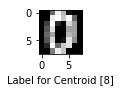
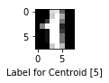
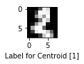
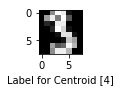
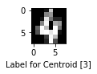
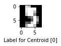
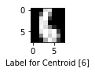
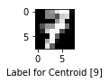
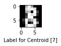
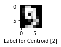

# K-Means

### All the the tools, libraries, and dataset used in this project

#### Optdigit Data Set: https://archive.ics.uci.edu/ml/datasets/optical+recognition+of+handwritten+digits
#### Pandas: https://pandas.pydata.org/
#### Numpy: https://www.numpy.org/
#### Python 3: https://www.python.org/downloads/
#### Jupyter Notebook: https://jupyter.org/
#### Spyder: https://www.spyder-ide.org/
#### Anaconda: https://www.anaconda.com/

#### Import necessary libraries


```python
import pandas as pd
import numpy as np
import matplotlib.pyplot as plt
import matplotlib.cm as cm
import random
import sys
from math import log2
np.set_printoptions(threshold=sys.maxsize)
np.seterr(divide='ignore', invalid='ignore')
```


    {'divide': 'warn', 'over': 'warn', 'under': 'ignore', 'invalid': 'warn'}


```python
numpber_of_features = 64
```

#### Load the training and testing datasets


```python
#Load the training data set
df_training = pd.read_csv('optdigits.train.csv', header=None)
df_training = df_training.values
# print ("Training Dataset with Labels")
# print (df_training)
```


```python
#Load the testing data set
df_testing = pd.read_csv('optdigits.test.csv', header=None)
df_testing = df_testing.values
# print ("Testing Dataset with Labels")
# print (df_testing)
```

#### Split Training Data set into data and labels


```python
#split trainingset data and training labels
training_data = np.array(df_training[:, 0:numpber_of_features])
training_labels = df_training[:, numpber_of_features]
# print ("Training Dataset:")
# print (training_data)
# print ("Training Dataset Labels:")
# print (training_labels)
```


```python
#split testset data and testing labels
testing_data = np.array(df_testing[:, 0:numpber_of_features])
testing_labels = df_testing[:, numpber_of_features]
# print ("Testing Dataset:")
# print (testing_data)
# print ("Testing Dataset Labels:")
# print (testing_labels)
```

#### Variables for K-Means


```python
# number of centroids
k = 10

# number of examples used for training and testing
training_data_examples = 3823
testing_data_examples = 1797
class_centroid_matches = None
model = None
training_predictions = np.zeros((training_data_examples,1), dtype=int)
testing_predictions = np.zeros((testing_data_examples,1), dtype=int)
```


```python
#distance from each centroids for each training example
training_distance_from_centroid = np.zeros((training_data_examples, k), dtype = float)

#closest centroid for each training example
training_closest_centroid = np.zeros((training_data_examples, 1), dtype = int)
```


```python
#distance from each centroids for each testing example
testing_distance_from_centroid = np.zeros((testing_data_examples, k), dtype = float)

#closest centroid for each testing example
testing_closest_centroid = np.zeros((testing_data_examples, 1), dtype = int)
```

#### Create k Number of Centroids


```python
# create k number of centroids selected from the training data set
centroids = training_data[random.randint(0,training_data_examples), :].reshape((1,numpber_of_features))
for i in range (0,k-1):
    r = random.randint(0,training_data_examples)
    new_centroid = training_data[r, :].reshape((1,numpber_of_features))
    centroids = np.vstack([centroids, new_centroid])

print(str(k) + " Centroids:")
print (centroids)
```

    10 Centroids:
    [[ 0  0  7 12  6  2  0  0  0  0 16 16 13 14  1  0  0  9 16 11  3  0  0  0
       0  8 16 16 16  4  0  0  0  1  2  0  6 12  0  0  0  0  0  0  7 12  0  0
       0  0  6  9 16  6  0  0  0  0  5 16  9  0  0  0]
     [ 0  0  7 12  8  0  0  0  0  6 16 11 15  3  0  0  0 10  8  0 11  5  0  0
       0  0  0  0 11  3  0  0  0  0  0  0 14  1  0  0  0  0  0  7 13  0  0  0
       0  0  8 16 16 14  9  0  0  0 11 13 11  8  9  0]
     [ 0  1 12 14  6  0  0  0  0  8 14  5 15  7  0  0  0  6 11  1 11 15  2  0
       0  1 14 16 13 16  8  0  0  0  0  0  0 12  8  0  0  1  3  0  0 11  9  0
       0  4 13  2  1 13  6  0  0  0 10 16 16  9  0  0]
     [ 0  0  0  0  5 13  3  0  0  0  0  1 11 16  4  0  0  2  8 14 16 16  5  0
       0  2  7  4 12 16  3  0  0  0  0  0  8 16  4  0  0  0  0  0  8 16  5  0
       0  0  0  0  8 16  8  0  0  0  0  0  8 16  6  0]
     [ 0  0  5 14  8  0  0  0  0  0 15 11 15  0  0  0  0  0  5  2 11  3  0  0
       0  0  0  9 16  5  0  0  0  0  1 12 12 15  5  0  0  0  0  0  0  5 12  0
       0  0  6  4  7 12 10  0  0  0  9 15 12  9  1  0]
     [ 0  3 15 15  3  0  0  0  0  8 15 14 14  0  0  0  0  4  9  2 16  5  0  0
       0  0  0  2 16  5  0  0  0  0  0  7 15  1  0  0  0  0  0 14  9  0  0  0
       0  1 11 16 10  8  4  0  0  5 16 16 16 16 11  0]
     [ 0  0  0 12 16  0  0  0  0  0  3 16 13  0  0  0  0  1 11 15  1  2  6  0
       0  6 16  6  1 13 13  0  0  5 16 14 12 16  5  0  0  0  7 14 16  7  0  0
       0  0  0 11 13  0  0  0  0  0  0 15  8  0  0  0]
     [ 0  0  7 15 15  9  1  0  0  7 15  5  4 14  4  0  0  2  2  0  7 13  1  0
       0  0  2 12 15  5  0  0  0  0  1  5 10 13  0  0  0  0  0  0  0 10  7  0
       0  0 11  1  1 12  7  0  0  0  8 14 13  8  0  0]
     [ 0  0  6 16 12  3  0  0  0  3 15  7  6 14  1  0  0  7 13  0  1 14  1  0
       0  4 13  8 13 13  0  0  0  2 15 15  7 13  5  0  0  0 12  5  0  9  8  0
       0  0 12  5  6 14  2  0  0  0  5 16 12  3  0  0]
     [ 0  0  7 14 16 12  0  0  0  0 15 11 15 15  0  0  0  0  0  1 16 10  0  0
       0  0  7 13 16 14 10  0  0  0 12 16 15 12  4  0  0  0  5 16  6  0  0  0
       0  0  7 16  2  0  0  0  0  0 10 14  0  0  0  0]]
    

#### Centroid Assignments


```python
# Assign the each data example to the closest centroid
# Calculate the Euler Distance - 64 Dimensions
def assign():
    global training_distance_from_centroid
    global training_closest_centroid
    for i in range(0, training_data_examples):
        for j in range(0, k):
            distance = (np.sqrt(np.sum((training_data[i, :] - centroids[j, :]) ** 2)))
            training_distance_from_centroid [i][j] = distance
        training_closest_centroid [i] = np.argmin(training_distance_from_centroid [i,:])
```

#### Update Centroids


```python
# Update centroids
def update():
    global training_closest_centroid
    global centroids
    for i in range(0, k):
        counter = 0
        total = np.zeros((1,64), dtype=float)
        for j in range(0, training_data_examples):
            if (training_closest_centroid [j] == i):
                total = total + training_data[j, :]
                counter = counter + 1
        centroids[i] = total/counter
```

#### Create a Model


```python
# create model to use with the test data
def create_model():
    global class_centroid_matches
    global model
    model = np.zeros((10,k), dtype=int)
    for i in range (0, training_data_examples):
        model[training_labels[i]][training_closest_centroid [i]] = model[training_labels[i]][training_closest_centroid [i]] + 1
    
    class_centroid_matches = np.zeros((10,1), dtype=int)
    for i in range (0, 10):
        class_centroid_matches [i] = np.argmax(model[i])
    
    print(" ")
    print ("number of examples for each label/centroid")
    print ("col:clusters - row: labels")
    print (model)
    
    print(" ")
    print("Cluster number for each label")
    print (class_centroid_matches)
```

#### Make Predictions


```python
# make predictions using the training data
# calculate the accuracy
def training_predict():
    global training_predictions
    for i in range(0, training_data_examples):
        for j in range (0, 10):
            if (class_centroid_matches[j] == training_closest_centroid[i]):
                training_predictions[i] = j
    wrong = np.count_nonzero(training_predictions.T - training_labels)
    accuracy = 100*(training_data_examples-wrong)/training_data_examples
    print(" ")
    print ("Training Accuracy " + str(accuracy))
```


```python
# calculate mean square error
def mse():
    mse = np.zeros((k,1))
    for j in range (0, k):
        mse_sum = 0
        counter = 0
        for i in range(0, training_data_examples):
            if training_closest_centroid[i] == j:
                mse_sum = mse_sum + (np.sqrt(np.sum((training_data[i] - centroids[j]) ** 2))) ** 2
                counter = counter + 1
        if counter == 0:
            mse [j] = 0
        else:
            mse [j] = mse_sum / counter
    print(" ")
    print ("Mean Square Error: " + str(mse))
```


```python
# calcuate mean square seperation
def mss():
    mss_sum = 0
    for i in range (0, k):
        for j in range (0, k):
            mss_sum = mss_sum + (np.sqrt(np.sum(centroids[i] - centroids[j]) ** 2)) ** 2
    mss_sum = mss_sum / ((k * (k-1)) / 2)
    
    print (" ")
    print ("Mean Square Seperation:" + str(mss_sum))
```


```python
# calcuate entropy for each cluster
def entropy():
    centroid_label = np.zeros((k,10))
    e = np.zeros((k,1))
    for i in range(0, training_data_examples):
        centroid_label[training_closest_centroid[i], training_labels[i]] = centroid_label[training_closest_centroid[i], training_labels[i]] + 1
    
    print(" ")
    print ("number of labels for each centroid")
    print ("col:labels - row: clusters")
    print (centroid_label)
    
    for i in range(k):
        total_labels = np.sum(centroid_label[i])
        sum_entorpy_cluster = 0
        for j in range(10):
            if centroid_label[i, j] == 0:
                sum_entorpy_cluster = 0
            else:
                sum_entorpy_cluster = sum_entorpy_cluster + (centroid_label[i, j]/total_labels * log2(centroid_label[i, j]/total_labels))
        e[i] = -1 * sum_entorpy_cluster
    
    print(" ")
    print ("Entropy for each cluster 0 - k")
    print(e)
    print(" ")
    print ("Mean Entropy")
    print(np.mean(e))
```


```python
# make predictions using the testing dataset
# calculate the accuracy
def testing_predict():
    global testing_distance_from_centroid
    global testing_closest_centroid
    global testing_predictions
    for i in range(0, testing_data_examples):
        for j in range(0, k):
            distance = (np.sqrt(np.sum((testing_data[i, :] - centroids[j, :]) ** 2)))
            testing_distance_from_centroid [i][j] = distance
        testing_closest_centroid [i][0]  = np.argmin(testing_distance_from_centroid [i,:])
    
    for i in range(0, testing_data_examples):
        for j in range (0, 10):
            if (class_centroid_matches[j] == testing_closest_centroid[i]):
                testing_predictions[i] = j
    wrong = np.count_nonzero(testing_predictions.T - testing_labels)
    accuracy = 100*(testing_data_examples-wrong)/testing_data_examples
    print(" ")
    print ("Testing Accuracy " + str(accuracy))
```


```python
# draw the confution matrix
def confusion():
    conf = np.zeros((10,10))
    for i in range (0, testing_data_examples):
         conf [testing_labels[i], testing_predictions[i]] = conf [testing_labels[i], testing_predictions[i]] + 1
    
    print(" ")
    print ("Confusion Matrix")
    print ("col:labels - row: predictions")
    print (conf)
```


```python
# chow the images of labels for each cluster
def show_image_label():
    for i in range(0, 10): 
        l = "Label for Centroid " + str(class_centroid_matches[i])
        img = plt.figure()
        plt.imshow(testing_data[i].reshape((8,8)), cmap = cm.Greys_r)
        img.set_size_inches ((0.8,0.8))
        plt.xlabel(l)
        plt.show()
```

# Experiments and Results

## Two experiements 

### Experiment 1

#### K= 10, Total Run: 5
#### Best Accuracy
#### Training Data: 88.85%
#### Testing Data: 86.25%

### Experiment 2
    
#### K= 30, Total Run: 5
#### Best Accuracy
#### Training Data: 50.77%
#### Testing Data: 47.57%


```python
i = 0 
while True:
    print("Episode " + str(i))
    i = i + 1
    assign()
    prev_centroids = np.copy(centroids)
    update()
    #print (centroids - prev_centroids)
    if (centroids == prev_centroids).all():
        print ("Training is completed")
        break
```

    Episode 0
    Episode 1
    Episode 2
    Episode 3
    Episode 4
    Episode 5
    Episode 6
    Episode 7
    Episode 8
    Episode 9
    Episode 10
    Episode 11
    Episode 12
    Episode 13
    Episode 14
    Episode 15
    Episode 16
    Episode 17
    Episode 18
    Episode 19
    Episode 20
    Episode 21
    Episode 22
    Episode 23
    Episode 24
    Episode 25
    Episode 26
    Episode 27
    Episode 28
    Episode 29
    Episode 30
    Episode 31
    Episode 32
    Episode 33
    Episode 34
    Episode 35
    Episode 36
    Episode 37
    Episode 38
    Episode 39
    Episode 40
    Episode 41
    Episode 42
    Episode 43
    Training is completed
    


```python
create_model()
```

     
    number of examples for each label/centroid
    col:clusters - row: labels
    [[  0   0   0   2   0   1   1   1 371   0]
     [  0  16  25   0   1 330   3  12   0   2]
     [  0 329  12   0   6   1   1  27   0   4]
     [  1   3  16   0 351   2   0  12   0   4]
     [  3   0   4 330   0   8   5   5   0  32]
     [265   0 104   1   3   1   2   0   0   0]
     [  0   0   0   1   0   4 372   0   0   0]
     [  0   0   0   0   1   2   0   5   0 379]
     [  2   0   7   1   2  18   4 346   0   0]
     [  4   0 324   7   3   6   0   2   0  36]]
     
    Cluster number for each label
    [[8]
     [5]
     [1]
     [4]
     [3]
     [0]
     [6]
     [9]
     [7]
     [2]]
    


```python
training_predict()
testing_predict()
```

     
    Training Accuracy 88.85691865027465
     
    Testing Accuracy 86.2548692264886
    


```python
mse()
mss()
entropy()
confusion()
```

     
    Mean Square Error: [[682.22181818]
     [637.22126437]
     [787.90243902]
     [731.54678363]
     [572.95640327]
     [772.91420912]
     [577.67010309]
     [744.00731707]
     [395.62264151]
     [752.52954048]]
     
    Mean Square Seperation:409.9555555555556
     
    number of labels for each centroid
    col:labels - row: clusters
    [[  0.   0.   0.   1.   3. 265.   0.   0.   2.   4.]
     [  0.  16. 329.   3.   0.   0.   0.   0.   0.   0.]
     [  0.  25.  12.  16.   4. 104.   0.   0.   7. 324.]
     [  2.   0.   0.   0. 330.   1.   1.   0.   1.   7.]
     [  0.   1.   6. 351.   0.   3.   0.   1.   2.   3.]
     [  1. 330.   1.   2.   8.   1.   4.   2.  18.   6.]
     [  1.   3.   1.   0.   5.   2. 372.   0.   4.   0.]
     [  1.  12.  27.  12.   5.   0.   0.   5. 346.   2.]
     [371.   0.   0.   0.   0.   0.   0.   0.   0.   0.]
     [  0.   2.   4.   4.  32.   0.   0. 379.   0.  36.]]
     
    Entropy for each cluster 0 - k
    [[0.14043537]
     [0.        ]
     [0.48416548]
     [0.13944835]
     [0.12087992]
     [0.80186626]
     [0.        ]
     [0.32162309]
     [0.        ]
     [0.28879762]]
     
    Mean Entropy
    0.22972160865430274
     
    Confusion Matrix
    col:labels - row: predictions
    [[176.   0.   0.   0.   2.   0.   0.   0.   0.   0.]
     [  0. 134.  21.   1.   0.   1.   3.   0.   7.  15.]
     [  1.   6. 150.   4.   0.   0.   0.   2.  10.   4.]
     [  0.   0.   1. 158.   0.   2.   0.   8.   6.   8.]
     [  0.  10.   0.   0. 158.   0.   0.   8.   5.   0.]
     [  0.   0.   0.   0.   1. 138.   1.   0.   0.  42.]
     [  1.   4.   0.   0.   0.   0. 175.   0.   1.   0.]
     [  0.   0.   0.   0.   1.   4.   0. 166.   8.   0.]
     [  0.  18.   1.   1.   0.   2.   1.   1. 141.   9.]
     [  0.   3.   0.   3.   5.   5.   0.   7.   3. 154.]]
    


```python
show_image_label()
```































